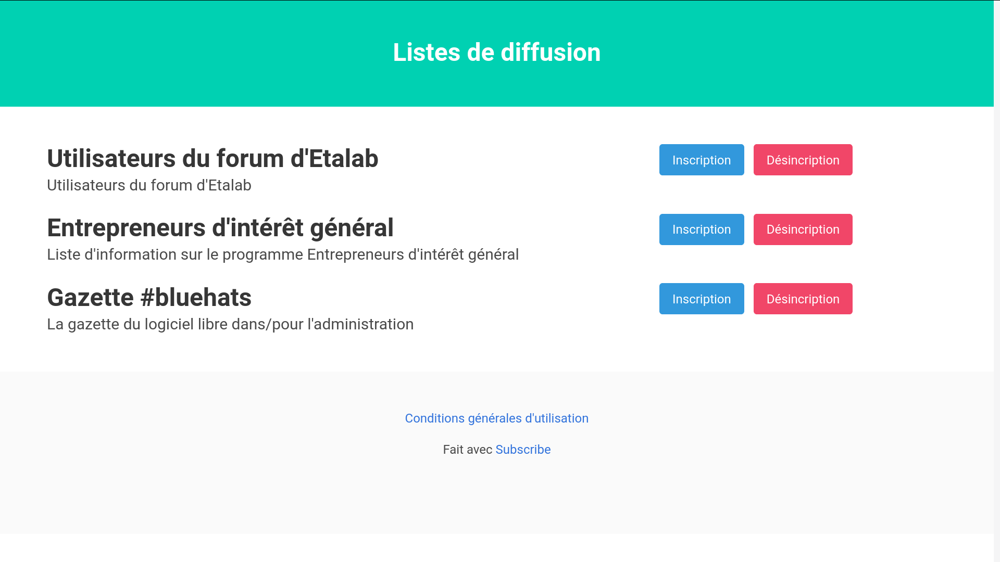

#  Subscribe

## Une interface web pour s'abonner à des listes de diffusion

Si vous utilisez [mailgun.com](https://www.mailgun.com), [mailjet.com](https://www.mailjet.com) ou [sendinblue.com](https://www.sendinblue.com) pour gérer des listes de diffusion mais que vous ne souhaitez pas que vos utilisateurs partagent leurs données avec un formulaire d'inscription tiers

- **Subscribe** peut vous aider !

Si vous avez plusieurs listes de diffusion (éventuellement gérées par plusieurs différents fournisseurs parmi mailgun/mailjet/sendinblue) et que vous voulez répertorier les différentes options d'abonnement à une liste sur une seule page

- **Subscribe** peut vous aider !



## Fonctionnalités

- Prise en charge de plusieurs fournisseurs d'emailing  [mailgun.com](https://www.mailgun.com), [mailjet.com](https://www.mailjet.com) ou [sendinblue.com](https://www.sendinblue.com)
- Inclure/Exclure des listes de diffusion une par une ou avec des expressions régulières
- Permettre à l'administrateur d'une liste de recevoir un courriel à chaque **x** inscription
- Personnaliser l'en-tête et le pied de page HTML de l'interface web
- Utilisez votre propre feuille de style (tant qu'elle est fondée sur [bulma.io](https://bulma.io))
- Interface utilisateur et courriels transactionnels en anglais et en français


## Configuration

La configuration d'**Subscribe** se fait en deux étapes :
- Définir des variables d'environnement pour les options globales (y compris les informations d'identification par défaut pour les courriers électroniques transactionnels)
- Éditer le fichier `config.edn` pour les listes de diffusion

### 1. Ajouter les variables d'environnement

#### Variables de l'application

```
export SUBSCRIBE_PORT=3000
export SUBSCRIBE_BASEURL="<nom_domaine>"
```

#### Variables de connexion au serveur SMTP

```
export SUBSCRIBE_SMTP_LOGIN="<email_webmestre>"
export SUBSCRIBE_SMTP_PASSWORD="<mot_de_passe_email_webmestre>"
export SUBSCRIBE_SMTP_HOST="smtp.mailgun.org"
export SUBSCRIBE_SMTP_PORT=587
```

#### Variables des API des fournisseurs d'emailing

##### Mailgun

- `export MAILGUN_API_KEY="<clef_api_mailgun>"`

##### Sendinblue

- `export SENDINBLUE_API_KEY="<clef_api_sendinblue>"`

##### Mailjet

```
export MAILJET_API_KEY="<clef_api_mailjet>"
export MAILJET_API_SECRET="<mot_de_passe_api_mailjet>"
```

**Attention** : seul [mailjet.com](https://www.mailjet.com) nécessite à la fois une clef API et un mot de passe, mailgun.com et sendinblue.com ne nécessitent qu'une clef API

### 2. Éditer le fichier `config.edn`

- Renommer `config_example.edn` en `config.edn`

**Attention** : Les options de configuration obligatoires sont `admin-email` et `backends`

## Test & Lancement

### Test

- `git clone https://github.com/etalab/infolettres.etalab.gouv.fr.git`
- `cd infolettres.etalab.gouv.fr`
- Configurer les variables (Voir [Configuration](#configuration))
- `clj -M:test`

### Lancement

#### Avec `clj -M:run`

- `git clone https://github.com/etalab/infolettres.etalab.gouv.fr.git`
- `cd infolettres.etalab.gouv.fr`
- Configurer les variables (Voir [Configuration](#configuration))
- `clj -M:run`


L'application est lancée sur http://localhost:3000 ou sur votre `<nom_domaine>`

#### Avec `lein run`

- `git clone https://github.com/etalab/infolettres.etalab.gouv.fr.git`
- `cd infolettres.etalab.gouv.fr`
- Configurer les variables (Voir [Configuration](#configuration))
- `lein run`

#### Avec Docker

En supposant que vos variables d'environnement sont stockées dans ``~/.subscribe_envs` et que vous voulez exposer le port `3000`

- `git clone https://github.com/etalab/infolettres.etalab.gouv.fr.git`
- `cd infolettres.etalab.gouv.fr`
- Configurer les variables (Voir [Configuration](#configuration))
- `docker build -t subscribe .`
- `docker run -it -p 3000:3000 --env-file=~/.subscribe_envs subscribe`

L'application est lancée sur http://localhost:3000

## TODO

- [ ] Détecter les erreurs avant de rediriger vers les pages de confirmation

## Soutenez l'écosystème Clojure

Si vous aimez Clojure, pensez à soutenir les mainteneurs en faisant un don à [clojuriststogether.org](https://clojuriststogether.org) !

## Licence

**Subscribe** est soumis à la licence Eclipse Public License 2.0
