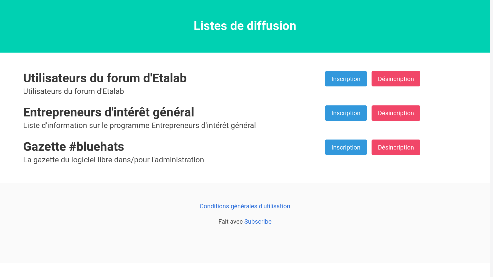

ℹ️ **The development repository is hosted on [SourceHut](https://git.sr.ht/~bzg/subscribe).**

If you use [mailgun.com](https://www.mailgun.com/), [mailjet.com](https://www.mailjet.com) or [sendinblue.com](https://www.sendinblue.com/) to manage
contacts/mailing lists but do not want your users to share data with
an third-party sign-up form, `Subscribe` can help.

If you have several mailing lists (possibly handled by several
different providers among mailgun.com, mailjet.com or sendinblue.com)
and want to list various list subscription options on a single page,
`Subscribe` can help.

# Features

-   Support [mailgun.com](https://www.mailgun.com/), [mailjet.com](https://www.mailjet.com) or [sendinblue.com](https://www.sendinblue.com/) mailing lists
-   Include/exclude mailing lists one by one or with regular expressions
-   Let the admin of a list receive an email every `x` subscriptions
-   Customize the HTML header and footer of the web interface
-   Use your own stylesheet (as long as it's based on [bulma.io](https://bulma.io))
-   UI and transactional emails in english and french

# Configure

Configuring `subscribe` is done in two steps: you first need to set
environment variables for global options (including the default
credentials for transactional emails), then to edit the `config.edn`
file for mailing lists.

## 1. Set up environment variables

Application variables:

    export SUBSCRIBE_PORT=3000
    export SUBSCRIBE_BASEURL="http://yourdomain.com"

Email credentials:

    export SUBSCRIBE_SMTP_LOGIN="postmaster@xxx"
    export SUBSCRIBE_SMTP_PASSWORD="your-password"
    export SUBSCRIBE_SMTP_HOST="smtp.mailgun.org"
    export SUBSCRIBE_SMTP_PORT=587

Backend-specific variables:

    # To handle mailgun.com mailing lists:
    export MAILGUN_API_KEY="your-key"
    
    # To handle sendinblue.com mailing lists:
    export SENDINBLUE_API_KEY="your-key"
    
    # To handle mailjet.com mailing lists:
    export MAILJET_API_KEY="your-key"
    export MAILJET_API_SECRET="your-password"

Note that only mailjet.com requires both an API key *and password*,
mailgun.com and sendinblue.com only requires an API key.

## 2. Define options in `config.edn`

Copy `config_example.edn` to `config.edn` and edit it.

The mandatory configuration options are `:admin-email` and `:backends`.

# Test

    ~$ git clone https://github.com/bzg/subscribe
    ~$ cd subscribe/
    ... [Set up your environment variables and config.edn]
    ~$ clj -M:test

# Run

## With `clj -M:run`

    ... [Set up environment variables]
    ~$ git clone https://github.com/bzg/subscribe
    ~$ cd subscribe/
    ... [Edit config.edn to configure mailing lists]
    ~$ clj -M:run

Then go to <http://localhost:3000> or to your custom base URL.

## With `java -jar`

    ... [Set up environment variables]
    ~$ git clone https://github.com/bzg/subscribe
    ~$ cd subscribe/
    ... [Edit config.edn to configure mailing lists]
    ~$ clj -M:jar
    ~$ java -jar target/subscribe.jar

## With docker

Assuming your environments variables are stored in `~/.subscribe_envs`
and you want to expose the 3000 port:

    ~$ git clone https://github.com/bzg/subscribe
    ~$ cd subscribe/
    ... [Edit config.edn to configure mailing lists]
    ~$ docker build -t subscribe .
    ~$ docker run -it -p 3000:3000 --env-file=~/.subscribe_envs subscribe

Then go to <http://localhost:3000>.

# Contribute

Contributions are welcome.  You can send feedback and patches to
[~bzg/dev@lists.sr.ht](mailto:~bzg/dev@lists.sr.ht).  For patches, please configure your local copy
of the repository to add a prefix to the subject line of your emails:

    ~$ git config format.subjectPrefix 'PATCH subscribe'

# Support the Clojure ecosystem

If you like Clojure(script), please consider supporting maintainers by
donating to [clojuriststogether.org](https://www.clojuriststogether.org).

# License

`subscribe` is licensed under the [Eclipse Public License 2.0](http://www.eclipse.org/legal/epl-v10.html).

